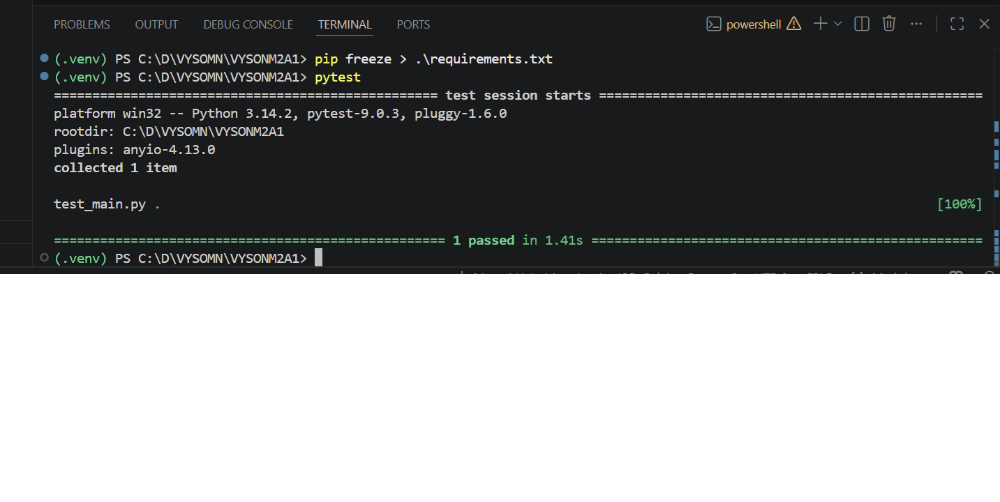

# URL Shortener API

A simple URL shortener built using FastAPI and SQLite.

---

## Features

- Shorten long URLs
- Redirect using short codes
- Integration testing with pytest
- SQLite database
- FastAPI + SQLAlchemy

---

## Setup Instructions

### 1. Clone the repository

```bash
git clone https://github.com/YOUR_USERNAME/YOUR_REPOSITORY.git
cd YOUR_REPOSITORY
```

---

### 2. Create virtual environment

```bash
python -m venv venv
```

---

### 3. Activate virtual environment

#### Windows

```bash
venv\Scripts\activate
```

#### Mac/Linux

```bash
source venv/bin/activate
```

---

### 4. Install dependencies

```bash
pip install -r requirements.txt
```

---

### 5. Run the FastAPI server

```bash
uvicorn main:app --reload
```

---

## API Documentation

Open Swagger UI:

```text
http://127.0.0.1:8000/docs
```

---

## API Endpoints

### POST /shorten

Shortens a long URL.

Example Request:

```json
{
  "url": "https://example.com"
}
```

Example Response:

```json
{
  "short_code": "abc123"
}
```

---

### GET /redirect?code=abc123

Redirects to the original URL.

---

## Running Tests

Run all tests using:

```bash
pytest
```

Expected Output:

```text
1 passed
```

---

## Project Structure

```text
.
├── main.py
├── db.py
├── models.py
├── test_main.py
├── requirements.txt
├── README.md
└── .gitignore
```

### Test Execution

