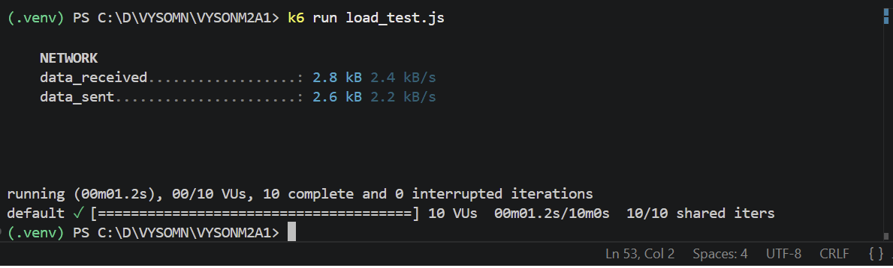
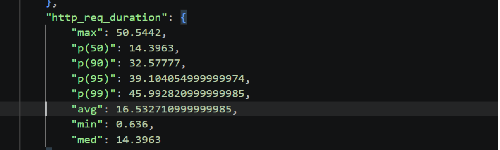

# URL Shortener API

A simple URL shortener built using FastAPI and SQLite.

---

## Features

- Shorten long URLs
- Redirect using short codes
- Integration testing with pytest
- SQLite database
- FastAPI + SQLAlchemy

---

## Setup Instructions

### 1. Clone the repository

```bash
git clone https://github.com/YOUR_USERNAME/YOUR_REPOSITORY.git
cd YOUR_REPOSITORY
```

---

### 2. Create virtual environment

```bash
python -m venv venv
```

---

### 3. Activate virtual environment

#### Windows

```bash
venv\Scripts\activate
```

#### Mac/Linux

```bash
source venv/bin/activate
```

---

### 4. Install dependencies

```bash
pip install -r requirements.txt
```

---

### 5. Run the FastAPI server

```bash
uvicorn main:app --reload
```

---

## API Documentation

Open Swagger UI:

```text
http://127.0.0.1:8000/docs
```

---

## API Endpoints

### POST /shorten

Shortens a long URL.

Example Request:

```json
{
  "url": "https://example.com"
}
```

Example Response:

```json
{
  "short_code": "abc123"
}
```

---

### GET /redirect?code=abc123

Redirects to the original URL.

---

## Running Tests

Run all tests using:

```bash
pytest
```

Expected Output:

```text
1 passed
```

---

## Project Structure

```text
.
├── main.py
├── db.py
├── models.py
├── test_main.py
├── requirements.txt
├── README.md
└── .gitignore
```

### Test Execution


## Load Testing

Load testing was performed using k6 with 10 simultaneous virtual users.

Command used:

```bash
k6 run load_test.js
```

### Load Test Result




## Performance Testing

Load testing was performed using k6.

### Run Load Test

Start the FastAPI server:

```bash
uvicorn main:app --reload
```

Run the k6 test:

```bash
k6 run load_test.js
```

---

### Export Performance Metrics

To export detailed metrics including p50, p90, p95, and p99:

```bash
k6 run --summary-export=summary.json load_test.js
```

This generates a `summary.json` file containing performance statistics.

---

### Percentile Metrics

The following metrics can be found inside `summary.json` under `http_req_duration`:

- p50
- p90
- p95
- p99

Example:

```json
{
  "p(50)": 4.12,
  "p(90)": 7.88,
  "p(95)": 8.91,
  "p(99)": 10.45
}
```

These values represent API response time percentiles in milliseconds.

---

### Load Test Configuration

- 10 simultaneous virtual users (VUs)
- 10 second test duration
- Tested endpoints:
  - `POST /shorten`
  - `GET /redirect`

### Performance Test Summary



